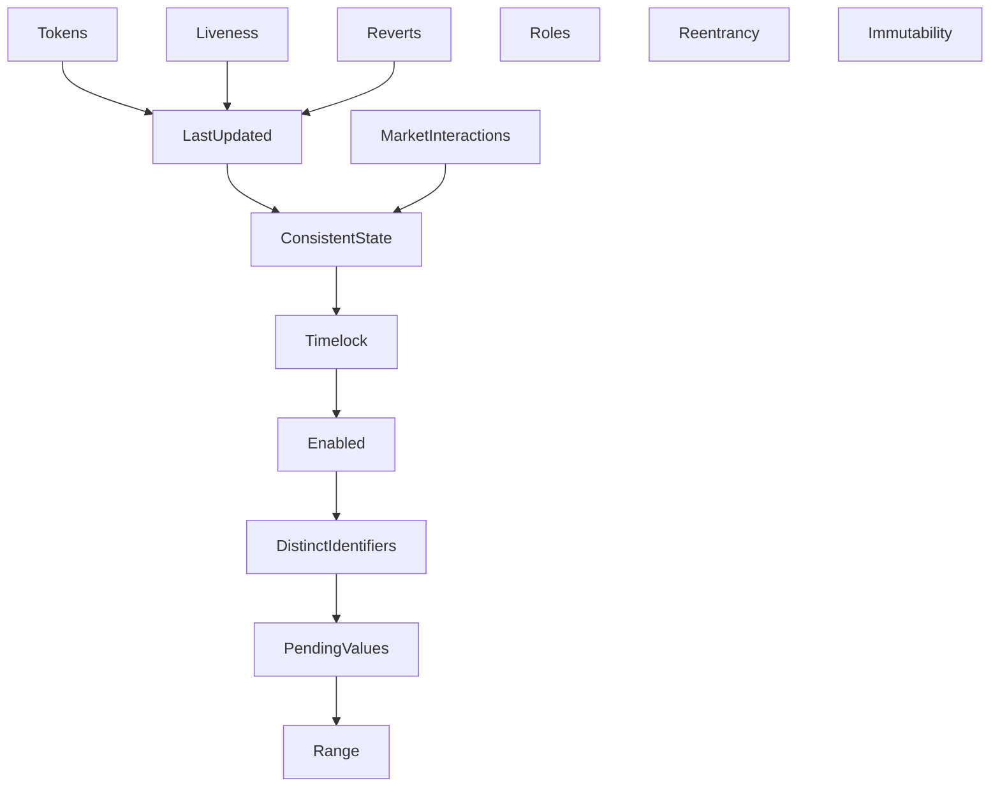

This folder contains the verification of MetaMorpho using CVL, Certora's Verification Language.

# Getting started

The code is compiled using 2 versions of solidity, which must be installed to run the verification as:

- `solc-0.8.21` for solidity compiler version 0.8.21 which is used for compiling MetaMorpho
- `solc-0.8.19` for solidity compiler version 0.8.19 which is used for compiling Morpho Blue.

The verification is run on modified source files, which are made available by running:

```
make -C certora munged
```

Install the `certora-cli` package with `pip install certora-cli`.
To verify specification files, pass to `certoraRun` the corresponding configuration file in the [`certora/confs`](confs) folder.
It requires having set the `CERTORAKEY` environment variable to a valid Certora key.
You can also pass additional arguments, notably to verify a specific rule.
For example, at the root of the repository:

```
certoraRun certora/confs/Range.conf --rule timelockInRange
```

# High-level description

A MetaMorpho vault is an ERC4626 vault that defines a list of Morpho Blue markets to allocate its funds.
See [`README.md`](../README.md) for an in depth description of MetaMorpho.

## ERC20 tokens and transfers

MetaMorpho relies solely on Morpho Blue markets to allocate funds.
It is verified in [`Tokens.spec`](specs/Tokens.spec) that all incoming tokens are forwarded to Morpho Blue markets, and that all outgoing tokens are forwarded to the user.

This verification relies on the fact that markets respect the constraints listed in the Morpho Blue documentation, in particular regarding ERC20 tokens.
The verification is done for the most common ERC20 implementations, for which we distinguish three different implementations:

- [ERC20Standard](dispatch/ERC20Standard.sol) which respects the standard and reverts in case of insufficient funds or in case of insufficient allowance.
- [ERC20NoRevert](dispatch/ERC20NoRevert.sol) which respects the standard but does not revert (and returns false instead).
- [ERC20USDT](dispatch/ERC20USDT.sol) which does not strictly respect the standard because it omits the return value of the `transfer` and `transferFrom` functions.

## Roles

MetaMorpho defines different roles to be able to manage the vault, the distinction between roles helps in reducing trust assumptions.
Roles follow a hierarchy, and this hierarchy is verified to hold in [`Roles.spec`](specs/Roles.spec).
More precisely, a stronger role is checked to be able to do the same operations of a lesser role.
Additionally, it is verified in [`Reverts.spec`](specs/Reverts.spec) that the roles are necessary to be able to do permissioned operations.
For example, the following rule makes sure that having the guardian role is necessary to be able to revoke a pending timelock:

```solidity
rule revokePendingTimelockRevertCondition(env e) {
    bool hasGuardianRole = hasGuardianRole(e.msg.sender);

    revokePendingTimelock@withrevert(e);

    assert lastReverted <=>
        e.msg.value != 0 ||
        !hasGuardianRole;
}
```

## Timelock

MetaMorpho features a timelock mechanism that applies to every operation that could potentially increase risk for users.
There are computations that give a lower bound for the period during which we know the values are under timelock, and this is verified in [`Timelock.spec`](specs/Timelock.spec).
The following function defined in [`PendingValues.spec`](specs/PendingValues.spec) is verified to always return `true`.

```solidity
function isSmallerPendingTimelock() returns bool {
    return assert_uint256(pendingTimelock_().value) < timelock();
}
```

Notice how increasing the timelock is itself not subject to a timelock, as it does not increase the risk for the user.
Indeed, a greater timelock means that the user would have more time to react to the vault's management operations that would not align with the user risk profile.

## Interactions with other contracts

This section details how externals calls are checked to be scoped, which ensures the safety of MetaMorpho.

### Reentrancy and immutability

MetaMorpho only interacts with Morpho Blue and with the loan token of the vault.
This is checked in [`Reentrancy.spec`](specs/Reentrancy.spec).
Informally, the loan token and the markets of MetaMorpho are trusted.
The former is known upfront by users, while markets are added through a timelock mechanism, which allows users (or by proxy, the guardian) to make sure that this addition is aligned with the desired risk profile.

Note also that these properties are ensured to always hold, because the contract is verified to be immutable in [`Immutability.spec`](specs/Immutability.spec).

### Consistent asset

For deposit and withdraw, it is checked that markets have the same loan token as the loan token of the vault.
We say that such market has a consistent asset.
The following function defined in [`ConsistentState.spec`](specs/ConsistentState.spec) is verified to always return `true` and contributes to verifying the property above.

```solidity
function isEnabledHasConsistentAsset(MetaMorphoHarness.MarketParams marketParams) returns bool {
    MetaMorphoHarness.Id id = Morpho.libId(marketParams);

    return config_(id).enabled => marketParams.loanToken == asset();
}
```

This checks that each market in the withdraw queue has a consistent asset.
Additionally, every supply and withdraw on Morpho Blue is checked to target an enabled market in [`MarketInteractions.spec`](specs/MarketInteractions.spec).

### Enabled flag

It is verified that the enabled flag tracks if a given market is in the withdraw queue.
The following function defined in [`Enabled.spec`](specs/Enabled.spec) gives one half of this property, and is verified to always return `true` for every index `i`.

```solidity
function isInWithdrawQueueIsEnabled(uint256 i) returns bool {
    if(i >= withdrawQueueLength()) return true;

    MetaMorphoHarness.Id id = withdrawQueue(i);

    return config_(id).enabled;
}
```

Throughout the code of MetaMorpho, this enabled flag is checked to be set to true, which is an efficient check that does not require to go through the whole withdraw queue.
This check also ensures that such markets have some properties, since verifying those are necessary to be added to the withdraw queue.
For example, markets added to the withdraw queue necessarily have a consistent asset.

### Last updated

The `lastUpdate` variable in Morpho Blue is used to discriminate if a market is created.
In MetaMorpho, every market in the supply queue or in the withdraw queue has been created.

```solidity
rule newSupplyQueueEnsuresPositiveCap(env e, MetaMorphoHarness.Id[] newSupplyQueue) {
    uint256 i;

    setSupplyQueue(e, newSupplyQueue);

    MetaMorphoHarness.Id id = supplyQueue(i);

    assert config_(id).cap > 0;
}
```

The previous rule ensures that when setting a new supply queue, each market has a positive supply cap.
Markets can have a positive supply cap only if they are created on Morpho Blue.
We can prove then that each market of the supply queue has been created on Morpho, because if a market has been created it cannot be "destroyed" later.

## Liveness

The liveness properties ensure that some crucial actions cannot be blocked.
It is notably useful to show that in case of an emergency, it is still possible to make salvaging transactions.
The `canPauseSupply` rule in [`Liveness.spec`](specs/Liveness.spec) shows that it is always possible to prevent new deposits.
This is done by first setting the supply queue as the empty queue and checking that it does not revert:

```solidity
require newSupplyQueue.length == 0;

setSupplyQueue@withrevert(e1, newSupplyQueue);
assert !lastReverted;
```

and then checking that any new deposit would revert.

## Other safety properties

### Range of variables

Some variables have defined range: queues have a maximum size, the timelock has an upper and a lower bound, and the fee is capped at 50%.
This last point is verified in the following rule defined in [`Range.spec`](specs/Range.spec):

```solidity
invariant feeInRange()
    fee() <= maxFee();
```

### Sanity checks

Other checks are done to ensure the safety of the code:

- it is checked in [`DistinctIdentifiers.spec`](specs/DistinctIdentifiers.spec) that there are no duplicates in the withdraw queue.
- it is checked in [`ConsistentState.spec`](specs/ConsistentState.spec) that fees cannot be accrued if the fee recipient is not set.
- various verification of input sanitization and revert conditions are done in [`Reverts.spec`](specs/Reverts.spec).

# Verification architecture

## Folders and file structure

The [`certora/specs`](specs) folder contains the following files:

- [`ConsistentState.spec`](specs/ConsistentState.spec) checks various properties specifying what is the consistent state of MetaMorpho, what are the reachable setting configurations (such as caps and fee).
- [`DistinctIdentifiers.spec`](specs/DistinctIdentifiers.spec) checks that the withdraw queue has no duplicate markets.
- [`Enabled.spec`](specs/Enabled.spec) checks properties about enabled flag of market, notably that it correctly tracks the fact that the market is in the withdraw queue.
- [`Immutability.spec`](specs/Immutability.spec) checks that MetaMorpho is immutable.
- [`LastUpdated.spec`](specs/LastUpdated.spec) checks that all Morpho Blue markets that MetaMorpho interacts with are created markets.
- [`Liveness.spec`](specs/Liveness.spec) checks some liveness properties of MetaMorpho, notably that some emergency procedures are always available.
- [`MarketInteractions.spec`](specs/MarketInteractions.spec) checks that every supply and withdraw from MetaMorpho is targeting an enabled market.
- [`PendingValues.spec`](specs/PendingValues.spec) checks properties on the values that are still under timelock. Those properties are notably useful to prove that actual storage variables, when set to the pending value, use a consistent value.
- [`Range.spec`](specs/Range.spec) checks the bounds (if any) of storage variables.
- [`Reentrancy.spec`](specs/Reentrancy.spec) checks that MetaMorpho is reentrancy safe by making sure that there are no untrusted external calls.
- [`Reverts.spec`](specs/Reverts.spec) checks the revert conditions on entrypoints.
- [`Roles.spec`](specs/Roles.spec) checks the access control and authorization granted by the respective MetaMorpho roles. In particular it checks the hierarchy of roles.
- [`Timelock.spec`](specs/Timelock.spec) verifies computations for periods during which we know the values are under timelock.
- [`Tokens.spec`](specs/Tokens.spec) checks that tokens are not kept on the MetaMorpho contract. Any deposit ends up in Morpho Blue and any withdrawal is forwarded to the user.

The [`certora/confs`](confs) folder contains a configuration file for each corresponding specification file.

The [`certora/helpers`](helpers) folder contains helper contracts that enable the verification of MetaMorpho.
Notably, this allows handling the fact that library functions should be called from a contract to be verified independently, and it allows defining needed getters.

The [`certora/dispatch`](dispatch) folder contains different contracts similar to the ones that are expected to be called from MetaMorpho.

## Specification imports graph


